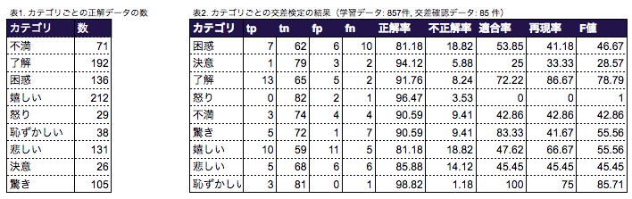
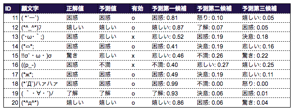
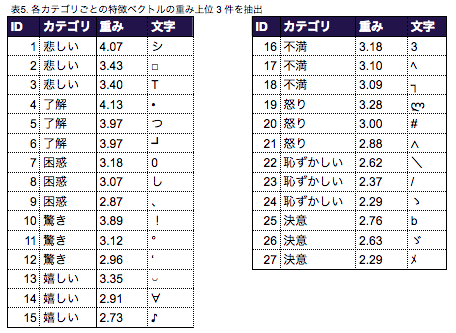
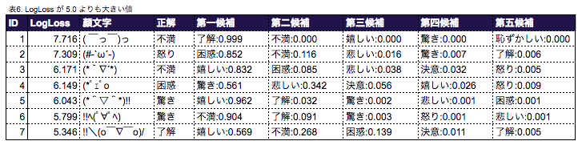

<script type="text/x-mathjax-config">
MathJax.Hub.Config({
  TeX: {
  	equationNumbers: { autoNumber: "AMS" },
    Macros: {
       b: ["\\mathbf{#1}", 1],
       bracket: ["\\left \\{ #1 \\right \\}", 1],
       argmax: ["\\underset{#1}{\\operatorname{argmax}}", 1]
    }
  }
});
</script>

## 1. はじめに

情報技術の革新と発達により、そこで発生するコミュニケーションもまた様々に発達してきた。特にインターネット上のコミュニケーションの発達は特に目覚ましい。
様々なソーシャルメディアでネット上でのオンラインでのコミュニケーションは今までにない以上に発展しており、実生活上でもその比率は年々に上昇してきている。LINE, Twitter, Instagram, Facebook, Slack などオンラインでの意思疎通を円滑に行うチャットツールやソーシャルメディアは具体例を挙げれば枚挙に暇がない。
さてそういったツールやり取りの中でも欠かせないものの一つとして「顔文字」がある。通常のメッセージとは別にその時々に適した感情を表すものとして利用される。「(｡・・｡) ｵｯｹｰ♪」、「m(_ _　)m」など表したい気持ちや思いをカジュアルに伝える手段として特に若い人の間で流行ってきた。

今回はその「顔文字」をどのように分類するか、という点を課題として設定した。この問題に対して機械学習の手法を使って予測を行い、どの程度の精度が達成できるか実験を行った。


### なぜ今顔文字の分類を行うのか？

分類された感情（「嬉しい」、「悲しい」など）を手掛かりに適切な顔文字（「(≧∇≦)b」, 「:-(）」）がサジェストできることが達成したい目標である。このような顔文字の補完を機械的に行う必要があり、この点こそまさに顔文字の分類の意義になる。なぜ顔文字が入力する機会が増えているのか、なぜその補完が必要なのか、なぜ分類を機械的に行わなければならないのか、の 3 つの観点に沿ってそれぞれの疑問に対する答えを本項で説明する。

はじめに、の冒頭で述べているようにインターネットや情報技術の発展に伴ってコミュニケーションのあり方の変化がしている。そのためチャットツールでのやり取り中心に顔文字が入力する機会は増えている。
インターネットでのオンライン上のやり取りが増える以前では親しい友人や家族とのやり取りは主に対面の話し言葉で行われていた。この時期の特徴としては距離の制約・口頭でのコミュニケーションの 2 つが特に特徴だった。文章についても本を中心とした推敲を重ねた文章が主であった。それが電話の出現とともに距離の制約がなくなり、ネットの到来とともに口頭からチャットでのコミュニケーションを主軸としたものに変化してきた。
これは今までに経験していなかった変化である。このような変化の中で、顔文字や絵文字などを利用する機会が増えた。

顔文字を入力する機会が増えていると同時に、それを入力する端末も合わせて変化しなければならない。なぜならこのような顔文字は、様々な特殊文字が入り組んでいるため覚えにくく、特殊文字を組み合わせて構成した表意文字のため打ちにくい。
そのような性質から顔文字を入力する際に入力デバイスに何らかの補完が必要になる。一般的に利用されているスマートフォンの iPhone や Android でも標準でこのような顔文字に対する補完が備わっている。それでは既にカテゴライズしているにもかかわらず、分類器を今新しく作る必要はあるのだろうか。
標準で備わっている補完機能については 2 つの欠点が存在する。一つは数の制約であり、もう一つは柔軟性に対する制約である。新しく顔文字の分類器そこで提供される顔文字の数で十分であれば問題ないが、これら IME で標準的に備わっている顔文字の数は限られている。この点が数に対する制約である。また、顔文字の大きな特徴として、新しい顔文字の流行や発見が頻繁に発生している点にある。新しい顔文字や流行りで最新の顔文字は標準的に提供されている IME には記載されていない。この点が柔軟性に対する欠点である。
このような欠点が存在するため、既存の IME に標準的に備わっている顔文字の分類では十分でないことは明らかであり、分類器を新しく作る必要性はこの点から考えても明らかであろう。

最後に機械的に分類を行う意義について説明する。
機械的に分類を行わなければならないのは人手でのコストがかかるからである。当然のことように思われるが、この人手でのコストという点を少し深く考えたい。人手でのコストがかかるのは大量の顔文字が存在し、新しい顔文字も日々増えているからである。この点に限って考えれば機械で分類を行うことのメリットは大きい。なぜなら、大量の顔文字を短時間で処理できる、新しい顔文字の追加などのメンテナンスが容易、のためである。
大量の顔文字が存在する理由としては、インターネットの発達だけではなく、ユニコードで登録されている文字が増えたため今まででは表現できなかった多用な顔文字が出現していることも理由の一つである。また、表意文字であるため少しの表現を変えることは比較的容易であり、日々新しい顔文字が簡単に作り出されている。
このように、仮にある時点の顔文字を人手で全て分類したとしてもその後新しい未知の顔文字は出現し対処しなければならず現時点でも大量の顔文字が存在する。この点が人手で分類することに対する大きなコストになっており、機械で行うことの大きなメリットになっている。

### 顔文字において用いた手法と期待する結果

今回は顔文字の推定に多変数のロジスティック回帰を用いた。
ロジスティック回帰は主に２値分類の問題で標準的に利用されている手法である。
各カテゴリへの分類だけでなく、それぞれのカテゴリに分類される確率も含めて計算したかったため、ロジスティック回帰を用いることにした。
決定木や識別関数（フィッシャーの線形判別機やSVM）の手法については確率が出力できない[^non-probablic]という欠点から利用しなかった。また、ナイーブベイズなどの生成モデルを利用しなかった理由については、生成モデルより識別モデルを利用する方が精度がよい[^discrimination-model]という一般的な結果が存在するため利用を控えた。
この他にも DeepLearning など機械学習を用いたカテゴリ分類の手法は存在するが、多変数のロジスティック回帰は前提する条件が最大エントロピーモデルだけ[^maximum-entropy]であり、一番自然で一般的な仮定だったため、この手法を使って学習と予測を行った。
また、ベイズ推定や MAP 推定などより高度な多変数ロジスティック回帰の手法については時間の制約上今回踏み込まなかった。

#### 期待していること・結論の想定

機械学習を用いて、比較的少数のサンプルからでも顔文字の感情が正しく分類できることを期待している。具体的な精度としては少なくとも 50% 以上の確率で適切に分類できる（マクロ適合率として 50% 以上）を期待して実験を行う。


## 2. 問題設定とモデルの解説

### 特徴量の構成方法

自然言語処理で一般的に用いられている bag-of-words にて特徴量の構成を行った。これはそれぞれの文字を独立した文字の集合のベクトルとして数式上でみなす手法である。具体的には例えば「(^o^)」は 「{'(' => 1, ')' => 1, '^' => 2, 'o' => 1}」のようなそれぞれの文字が独立したベクトルに変換して予測を行う。
bag-of-words の欠点の一つとして、ベクトルへと変換する過程でそれぞれの文字の位置の情報が消滅する。しかしながらこのような消失が発生することも踏まえても高い精度を出せることがわかっている[^bag-of-words]。そのような欠点を克服するものとして文字の分散表現[^COW]などが用いられることも多いが、今回は文字の種類が少なくベクトルの次元の数も一定以内に収まるため複雑な手法は用いなかった。


### ロジスティック分布の導出

#### 確率モデルで分類問題を表す

以下では一般的な形でモデリング化するため、入力の変数を $ \bf{x} \in \bf{R^D} $ として出力のラベルを $ C \in \{C_1, C_2, ..., C_K \} $  とする。 $ \bf{x} $ が顔文字の特徴ベクトルであり、その顔文字がどのカテゴリに属するかを $ C $ で表している。

今回は確率モデルとして定式化するため、ある入力が与えられたときの特定のラベルが出現する確率を考えればよい。

これは条件付き確率 $ P(C|\bf{x})$  として表せる。したがって、ある入力値 $ \bf{x} $ が与えられときの最適なラベルは、この条件付き確率を最大化させるようなラベルである。
この最適なラベルを $ C^{\star} $ とすれば以下のようにして

$$
\newcommand{\b}[1]{\mathbf{#1}}
\newcommand{\prob}[0]{P(C_k|\b{x^{(n)}})}
\newcommand{\probe}[0]{P_k^{(n)}}
\newcommand{\probeh}[0]{P_d^{(m)}}
\newcommand{\probw}[0]{\frac{\partial \probe}{\partial \probeh}}
\newcommand{\phix}[1]{\b{\phi(x^{(#1)}})}
\begin{align}
	C^{\star} = \argmax{k} P(C_k|\bf{x}) \label{eq:0.1}
\end{align}
$$

未知の入力値に対するラベルの予測を与えることができる。

以後は一般化も踏まえて、入力ベクトルを固有の特徴を抽出する変換 $ \bf{\phi(x)} \in \bf{R^{K}} $ を加えたものを前提に考える。

#### 最大エントロピー原理

さて、上記の議論はあくまで何らかのパラメーター $ \bf{\omega} $ を用いて上記の条件付き確率を制限して $ P(C|\bf{x}; \omega) $ のように表せないと、議論がこれ以上先に進めない。
そのため最大エントロピー原理を用いて、トレーニングデータが与えられときに、尤もらしい確率分布がどのように表せるかを考えたい。

以後は計算を簡単にするために、出力のラベルはすべて 1 of K 符号化で表されているとしよう。1 of K 符号化でラベルがエンコードされる場合、正解データが $ C_k $ とすると L 次元ベクトル $ \bf{t} \in \bf{R^{L}} $ として表せる。このとき $ t_i \in \{0, 1\} $ かつ $ t_i = \delta_{i,k} \, (i = 1, 2, ..., L) $ が成り立っている。
デルタ関数の定義は以下の通りである。

$$
\delta_{i,k} = \begin{cases}
	1 & (i = k) \\
	0 & (i \neq k) \\
\end{cases}
$$

定義がややこしそうだが、結局ラベルが L 個あったら L 次元ベクトルとして表し、$ C_k $ が正解データであれば k 番目の要素を 1 としてそれ以外を 0 とするベクトルである。

ここで、トレーニングデータとそのラベルをそれぞれ
$$
\begin{align}
	(\phix{1}, \bf{t^{(1)}}), (\phix{2}, \bf{t^{(2)}}),\, ...\, (\phix{N}, \bf{t^{(N)}}) \label{eq:1.0}
\end{align}
$$

が与えられたとする。
このとき

$$
\begin{align}
	\sum_{k = 1}^{K} \prob  & = 1 \hspace{15pt} (n = 1, 2, ..., N) \label{eq:1.1} \\
	\sum_{n = 1}^{N} \prob \, \phix{n} & = \sum_{n = 1}^{N} t_k^{(n)} \phix{n}  \hspace{15pt} (k = 1, 2, ..., K) \label {eq:1.2}
\end{align}
$$

が満たさなけれはならないと仮定しよう。

$ \eqref{eq:1.1} $ は確率の定義より明らかに満たさなければならない。
$ \eqref{eq:1.2} $ についてはいわゆる $ \prob $ が十分 $ t_k^{(n)} $ をよく表さなければならない、という制約である。条件付きエントロピーは $ - \sum_{k=1}^{L} \prob \ln \prob $ より、これを $ \eqref{eq:1.1}, \eqref{eq:1.2} $ の制約の元で最大化すればよい。
$ \probe = \prob $ のように簡易的に表すことにすれば、ラグランジュの未定乗数法[^Lagrange]より

$$
\begin{equation}
	H(p) = \sum_{n = 1}^{N} \sum_{k = 1}^{K} - \probe \ln \probe \\
		+ \sum_{n = 1}^{N} \lambda^{(n)} \{ \sum_{k = 1}^{K} \probe - 1 \} \\
		+ \sum_{k = 1}^{K} \b{\omega_k}^{t} \{\sum_{n = 1}^{N} \phix{n} (\probe - t_k^{(n)})\} \label{eq:1.3}
\end{equation}
$$

を最大にするような $ \probe $ を求めればよいことがわかる。
ここでスラッグ変数 $ \lambda^{(n)} $ と $ \b{\omega_k}^{t} $ を導入した。

#### $ \probe $ を求める

式の定式化までは行えたのであとは $ H(p) $ を単純に $ \probeh $ で微分すればよい。

$$
\newcommand{\partialh}[0]{\frac{\partial H(p)}{\partial \probeh} }
\newcommand{\omegam}[1]{\b{\omega_{#1}^{t}} \phix{m}}
\newcommand{\expw}[1]{\exp \left \{ #1 \right \}}
\begin{aligned}
	\partialh & = \sum_{n, k} \left \{
		- \probw \{\ln \probeh + 1\} +
		\lambda^{n} \{ \probw \} +
		\b{\omega_k^{t}} \phix{n} \probw
	\right \} \\
	& = - ln \probeh - 1 + \lambda^{(m)} + \omegam{d}
\end{aligned}
$$

のように求まるので、以下のように微分をゼロをおけば

$$
\begin{align}
	\partialh & = 0 \\
	\probeh & = \exp \left \{
		\lambda^{(m)} - 1 + \omegam{d}
	\right \} \label{eq:1.4}
\end{align}
$$

$ \eqref{eq:1.4} $ を $ \eqref{eq:1.1} $ に代入すれば

$$
\begin{align}
	\expw{ \lambda^{(m)} - 1 } = \exp{(\omegam{d})} \label{eq:1.5}
\end{align}
$$

より $ \eqref{eq:1.5} $ を $ \eqref{eq:1.4} $ に代入して添字を整理すれば、

$$
\begin{align}
	\bbox[10pt, border: 2px dotted black]{
		\probe = \prob = \frac{
			\exp{(\omegam{k})}
		}{
			\sum_{d=1}^{K} \exp{(\omegam{d})}
		}
	} \label{eq:1.6}
\end{align}
$$

と表せる。
このようにして目的であった条件付き確率分布がパラメーター  $ \b{\omega_{d}^{t}} $ を用いて表せるところまで求めることができた

$ \eqref{eq:1.6} $ は多変数のロジスティック分布である

### 多変数ロジスティック分布の最尤推定
条件付き確率分布が得られたので $ \eqref{eq:1.0} $ のトレーニングデータが与えられたときに負の対数尤度は以下のように表せる。

$$
\newcommand{\bracket}[1]{\left \{ #1 \right \}}
\begin{align}
	H(\b{W}) & = - \ln \bracket{
		\prod_{n = 1}^{N} \prod_{k = 1}^{K} \prob^{t_k^{(n)}}
	} \\
	& = - \sum_{k, n} t_k^{(n)} {\rm ln} \,\probe \label{eq:2.1}
\end{align}
$$

この対数尤度を最小化するような $ \b{W} = \b{\omega_{k}^{t}} \hspace{5pt} (k = 1, 2, ... K) $ を最急勾配法[^steepest-descent-method]によって表せればよい。

ただしここで

$$
\begin{align}
	\probe & = \frac{\exp \bracket{a_k^{(n)}}}{\sum_{d=1}^{K} \exp \bracket{a_d^{(n)}}} \\
\end{align}
$$

また

$$
\begin{aligned}
	a_k^{(n)} & = a_k(\b{x^{(n)}}) \\
	        & = \omegam{k} \\
	        & = \sum_{d = 1}^{D} \omega_{k,d} \phi_{d}(\b{x^{(n)}}) \\
	        & = \sum_{d = 1}^{D} \omega_{k,d} \phi_{d,n} \hspace{10pt} (\phi_{d}(\b{x^{(n)}}) = \phi_{d,n} とした)
\end{aligned}
$$

とする。
$ \eqref{eq:1.6} $ の関係式を変数の依存関係で分割しただけである。

このとき $ P_k $ に対して $ a_j $ の微分を考えると

$$
\newcommand{\expA}[1]{\exp \bracket{{#1}}}
\newcommand{\sumExpA}[0]{\sum_{d=1}^{K} \expA{a_d}}
\newcommand{\fracSumExpA}[0]{\frac{\expA{a_k}}{\sumExpA}}
\newcommand{\partialAj}[0]{\frac{\partial}{\partial a_j}}
\begin{aligned}
	\frac{\partial P_k}{\partial a_j}
		& = \partialAj \bracket{\fracSumExpA} \\
		& = \bracket{\partialAj (\expA{a_k})} \frac{1}{\sumExpA} + \\
			& \expA{a_k} (- \frac{1}{(\sumExpA)^2}) \partialAj \bracket{\sumExpA} \\
		& = \frac{\expA{a_k}}{(\sumExpA)} ( \delta_{jk} - \frac{\expA{a_j}}{(\sumExpA)} ) \\
		& = P_k (\delta_{k,j} - P_j)
\end{aligned}
$$

より

$$
\begin{align}
	\frac{\partial P_k}{\partial a_j} = P_k (\delta_{k,j} - P_j)
\end{align}
$$

が成り立つため $ \eqref{eq:2.1} $ を $ \omega_{m,j} $ に対して微分すると

$$
\begin{aligned}
	\frac{\partial H(\b{W})}{\partial \omega_{m,j}}
		& = 
			\sum_{n=1}^{N} \sum_{k=1}^{K} \sum_{l=1}^{K}
			t_k^{(n)} \bracket{
				\frac{\partial}{\partial a_l^{(n)}} ln P_k^{(n)}
			} \frac{\partial a_l^{(n)}}{\partial \omega_{m,j}} \\
		& = - \sum_{n, k, l} t_k^{(n)} P_k (\delta_{k,l} - P_j) \frac{\partial}{\partial \omega_{m,j}} \bracket{\sum_{d=1}^{D} \omega_{l,d} \phi_{d,n}} \\
		& = - \sum_{n, k, l} t_k^{(n)} P_k (\delta_{k,l} - P_j) \delta_{m,l} \phi_{j,n} \\
		& = \sum_{n=1}^{N} \bracket{
			P_m^{(n)} - t_m^{(n)}
		} \phi_{j,n}
\end{aligned}
$$

添字を差し替えて

$$
\begin{align}
	\frac{\partial H(\b{W})}{\partial \omega_{k,d}} =
		\sum_{n=1}^{N} \bracket{ P_k^{(n)} - t_k^{(n)} } \phi_{d,n} \label{eq:2.2}
\end{align}
$$

と与えられることがわかる。

#### 最急降下法の規則まとめ

微分が得られたので最急降下法で停留解を得ることが可能になる。
これまでの議論をまとめると、微小変数を $ \eta $ として規則は以下で与えられる

$$
\begin{aligned}
	\omega_{k,d}^{(new)} 
		& = \omega_{k,d} - \eta \frac{\partial H}{\partial \omega_{k,d}} \\
		& = \omega_{k,d} - \eta \sum_{n=1}^{N} \bracket{ P_k^{(n)} - t_k^{(n)} } \phi_{d,n} \\
	P_k^{(n)} & = \frac{\expA{a_k^{(n)}}}{\sum_{d=1}^{K} \expA{a_d^{(n)}}} \\
	a_k^{(n)} & = \sum_{d = 1}^{D} \omega_{k,d} \phi_{d,n} \\
	\phi_{d,n} & = \phi_d(\b{x^{(n)}})
\end{aligned}
$$

またこのようにして求められた最適解 $ \omega_{d,k}^{\star} $ にを用いて $ \eqref{eq:0.1} $ ラベルの予測を行えることができる。
また最急降下規則の微小変数 $ \eta $ については adagrad[^adagrad] を用いて更新を行った。
学習規則部分の擬似コードは以下の通りである。

```
for k in K
	for d in D
		weights[k][d] = 0.0
	endfor
endfor
H_prev = 0
H = MAX
eta = SMALL_AMOUNT
while (H - H_prev) > e
  for k in K
    for d in D
        eta = adagrad(eta)
    	weights[k][d] = ada_grad(eta) * grad(k,d, training_data)
    endfor
  endfor
  H_prev = H
  H = calculate_log_likelihood(weights, training_data)
end
```

関数 ada\_grad で 微小量 $ \eta $ の更新を行い関数 grad で $ \frac{\partial H}{\partial \omega_{k,d}} $ の計算を行う。また、calculate\_log\_likelihood で $ H(\b{W}) $ の計算を行い、差分が十分小さくなった場合に終了させる。

#### ニュートンラフソン法（二次の微小量）
最急降下法ではなく二次の微小量を用いてニュートンラフソン法
[^newton-method]を使うことも可能である

$ \eqref{eq:2.2} $ をさらに $ \omega_{s,t} $ で微分すると

$$
\begin{aligned}
	\frac{\partial^2 H}{\partial \omega_{s,t} \partial \omega_{k,d}} 
		& = \sum_{n=1}^{N} \frac{\partial P_k^{(n)}}{\partial \omega_{s,t}} \phi_{d,n} \\
		& = \sum_{n=1}^{N} \sum_{l=1}^{K} \frac{\partial P_k^{(n)}}{\partial a_l^{(n)}} \dfrac{\partial a_l^{(n)}}{\partial \omega_{s,t}} \phi_{d,n} \\
		& = \sum_{n=1}^{N} \sum_{l=1}^{K} P_k^{(n)} \bracket{\delta_{k,l} - P_{l}^{(n)}} \delta_{s,l} \phi_{t,n} \phi_{d,n} \\
		& = \sum_{n=1}^{N} P_k^{(n)} \bracket{\delta_{k,s} - P_{s}^{(n)}} \phi_{t,n} \phi_{d,n} \\
\end{aligned}
$$

と得られる。
最急降下法は 1 次収束、ニュートンラフソン法は 2 次収束のため後者の手法を利用する方が収束が早く効率がよいが今回はこの手法を用いなかった。特徴ベクトルの次元数 $ D $ とカテゴリの種類 $ |C| $ とするとロジスティック回帰におけるニュートンラフソン法で必要なメモリ使用量と計算量は $ D^2 |C|^2 $ と学習のコストが非常に膨大になるためである。


## 3. 実験方法と実験結果

### 利用したデータ
今回データとしてはインターネットから自動的に集めた顔文字のデータ 3 万件の中からランダムに 942 件の顔文字抽出し手動での分類を行った。「嬉しい」「悲しい」など 9 種類のラベルを用いて分類を行った。[^github-category-raw-data]
データの検証には交差検定を用いて行った。それぞれ 857 件のデータを用いて学習し残りの 85 件の未知データ対して予測を行い精度を確かめた。
プログラムについては Ruby で実装し、機械学習ライブラリは利用せずスクラッチで多クラスロジスティック分布の学習パラメーターの更新規則を計算し予測した。[^github-code]
また、2. の問題設定で説明した特徴量の変換ベクトル $ \bf{\phi(x)} \in \bf{R^{K}} $ については恒等写像 $ \bf{\phi(x)} = \bf{x} $ を用いて学習や予測をした。カーネル法を使わなかったため恒等写像を用いることにした。

最後にこれからの結果については、マイクロ適合率、マイクロ再現率、マクロ適合率、マクロ再現率、平均正解率、平均不正解率、などを用いて効果の検証している。

**表1** に各カテゴリごとのラベルの頻度分布を入れた。
これらのデータは手動で用意されたものである。

### 実験結果

実際にこれからのデータとセクション 2 で述べた学習アルゴリズムを用いて実験を行った。汎化性能を確認するため、学習データ 942 件中 857 件を利用し、残りの 85 件のデータを用いて交差検定を行って各種評価を行った。カテゴリごとの正解率や不正解率適合率などのデータは **表2** の通りである。



またマクロ適合率やマイクロ適合率などの各種指標も計算し評価した。
**表3** に記載の通りである。
今回は確率をモデルを用いたため、Logarithmic Loss[^logLoss] を用いてその値も計算した。


**表3** の結果からもわかるように、分類の精度はあまり高くない。平均の LogLoss が 1.448 のため平均すると $ exp(-1.448) = 0.24 $ 程度が正解確率に対しての信頼性である。
なぜこのような結果になったのかを詳しく調べるため、実際にどのようなデータが大きく誤っているのかを確認してみた。

以下の **表4** は交差確認に用いたデータ 85 件の中から 20 件サンプルとして取り出したものである。予測値と候補値とその確率も上位3件まで載せている。




このデータを確認すると全体の傾向がわかる。例えば ID: 2 や ID: 5, ID: 7, ID: 13 などは第二候補まで考慮に入れるときちんと正解していることがわかる。実際 ID: 13 などの「困惑」と「悲しい」の違いや、ID: 7 の「嬉しい」と「了解」の違いなどは人が分類してもそもそも判定が難しい部類に入るだろう。
このように分類の精度が低かったのは事実だが、学習データのそもそもの不備や感情推定という性質上カテゴリ間が明確に分類できない顔文字が出てきてしまうことに主に起因していることがわかる。

次に学習に用いた各種重みベクトルの上位 3 件についてカテゴリごとにそれぞれ出した。**表5** の通りである。ロジスティックモデルの各種重みの大きさを知ることで、どの文字がどのくらい対象のカテゴリに寄与しているかわかる。重みが大きければ大きい程カテゴリへの寄与が高くなる。



ID: 3 などは顔の目に対応する部分である。涙に対応する部分をきちんと学習していることがわかる。また嬉しいの ID: 13, ID: 14 などはそれぞれ顔文字の "口" の部分に対応しているのだろう。それぞれの口が上向きになっており、たしかに嬉しそうな顔文字を想像できる。逆に ID: 17 などの文字も同様に "口" の部分に対応していると思われるが、不満を表すような「へ」の字型になっていることがわかる。このようにきちんと感情と文字が一定程度関連性を持っているのが確認できる。
それぞれの文字は bag of words として扱っているため位置の情報は消失しているが、それぞれの口や目など主な特徴をしっかりと学習していることがわかる。

最後にどの顔文字の感情推定が特に大きく誤っている分析したかったため、LogLoss が一定値以上大きな顔文字を取り出した。**表6** にてまとめている。



このデータを確認すると位置の情報の消失が一定程度影響を与えていることがわかる。
例えば、1 行目の「不満」に関しては口の部分が「つ」で表現されている。了解として誤識別されている理由はこの「つ」の部分を手の部分とみなして「了解」に分類しているのだろう。また、5行目や 7 行目のデータに代表されるように、学習データよりも候補データの方が適している感情も一定存在する。学習データに一部適切でないデータが混入していることも精度の低下に寄与しているはずである。

## 4. 終わりに

顔文字の推定として多クラスロジスティック回帰を用いて、顔文字の生データから感情を推定するというタスクを行って評価を行った。結果としてはマクロ適合率が 50 % 以上という当初の目的は達成できた。しかしながら $ LogLoss $ の値が 1.45 にとどまるなど今後の課題もまた浮き彫りになった。実験データの分析を通して今後の改善点として以下の点を挙げられる

- 1. 単純な bag of words として特徴ベクトルを構築するのではなく、文字の分散表現など位置の情報も一定程度考慮した特徴ベクトルを用いて学習を行う
- 2. データの中にそもそも誤りが入っていたため、正しく分類できるように学習データの品質を見直す
- 3. 多クラスロジスティック分布だけではなく他の手法も比較検討する
- 4. 最尤推定ではなく多クラスロジスティック分布に対するベイズ推定[^baysian-method]や近似推論[^approximatereasoning]などより高度な手法を行って推定を行う

このように新しい課題についても引き続き取り組みを行い、より精度を上げる手法を検討していく。


## 5. 付録・文献

[^COW]: COW
[^non-probablic]: non-probablic
[^maximum-entropy]: maximum-entropy
[^discrimination-model]: discrimination-model
[^bag-of-words]: bag of words
[^Lagrange]: Lagrange
[^adagrad]: adagrad
[^steepest-descent-method]: steepest-descent-method
[^github-category-raw-data]: 顔文字の生データ 29358 件 https://github.com/takuma-saito/kaomoji_classifier/blob/master/data/raw.txt
[^github-code]: github-code
[^logLoss]: logLoss
[^baysian-method]: baysian-method
[^approximatereasoning]: approximatereasoning